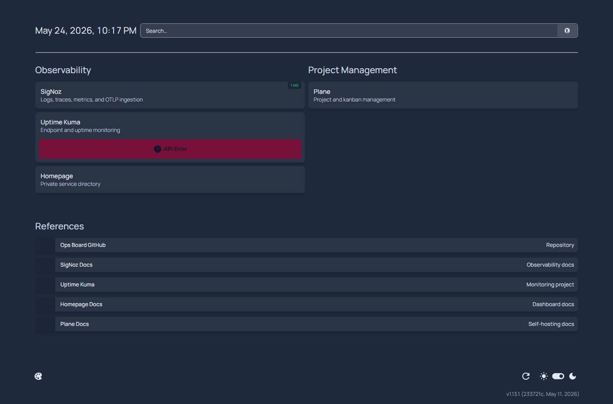
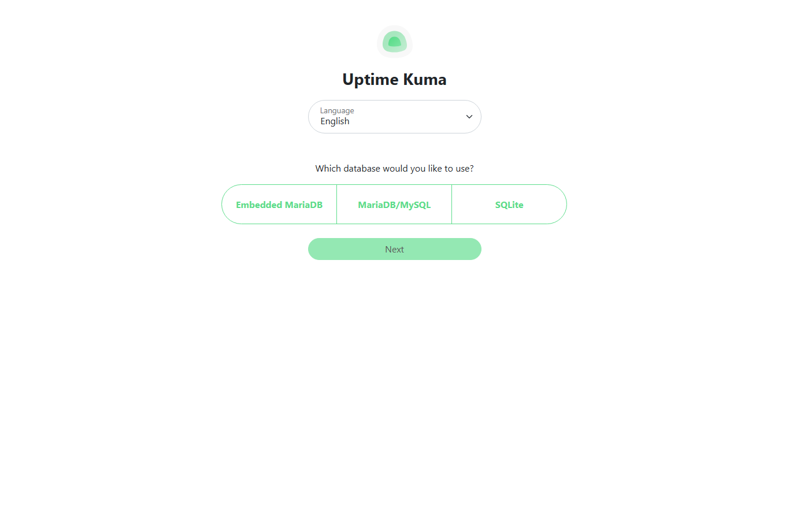
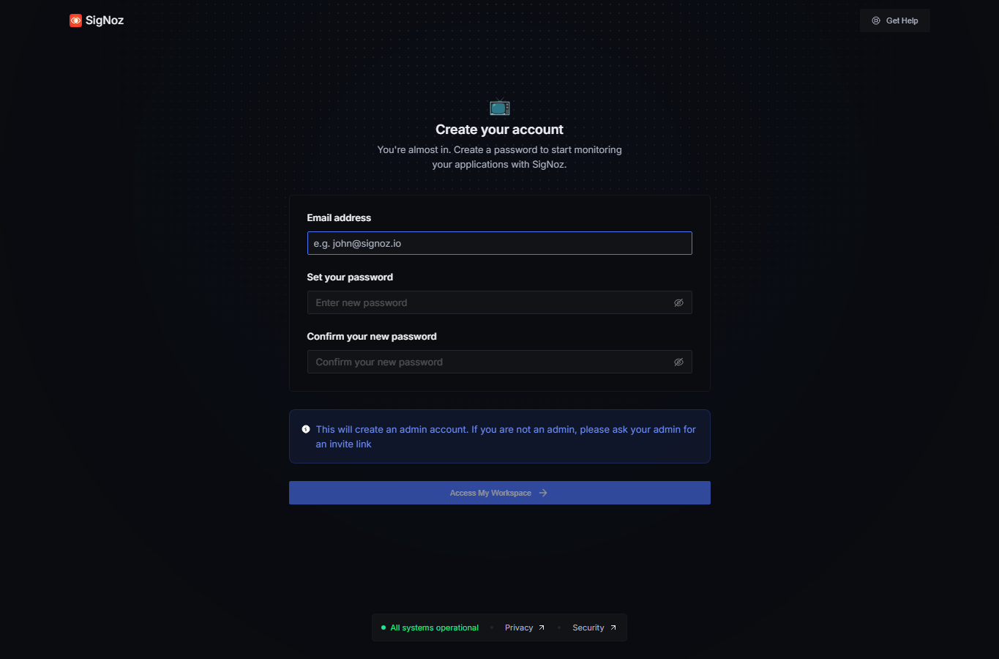
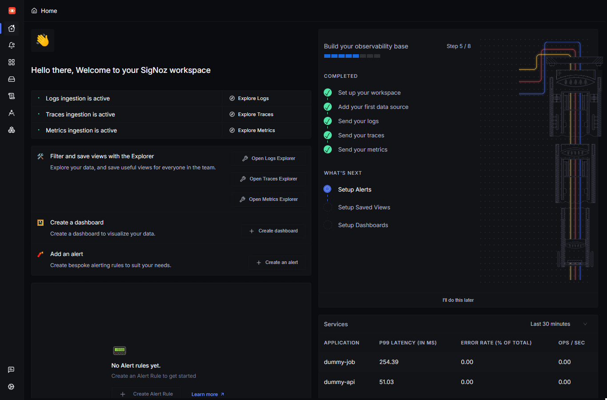
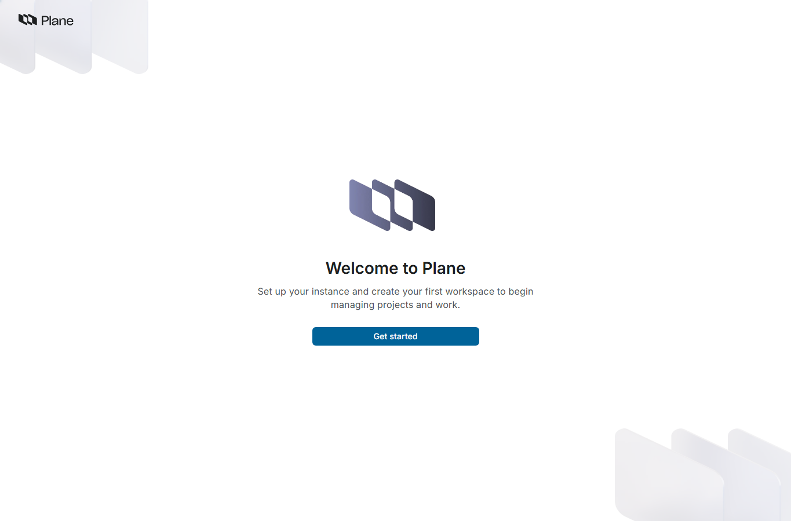
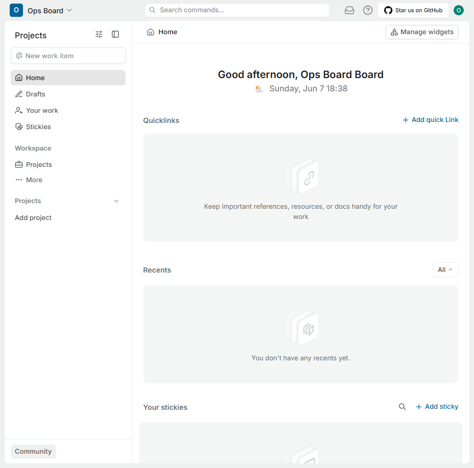

# Ops Board User Manual

Ops Board is a private operations board for projects that run across local machines, VPSs, countries, and cloud providers.

Use it when you need to answer:

- What projects exist and where do I start?
- Is a project alive right now?
- What happened inside a job, API request, or service?
- Who owns the project and where does it run?
- What follow-up work should be tracked?

Tailscale is the access layer for v1. Do not expose dashboards publicly unless the access model is intentionally changed.

## Where To Start

Start with Homepage:

```text
http://hp-15:3000
http://<ops-board-tailscale-hostname>:3000
```

Use `localhost` only from a shell or browser running directly on the deployment host.

Homepage should link to:

- SigNoz
- Uptime Kuma
- Plane
- Ops Board docs

## Fresh Local Setup

From a clean checkout or after an intentional reset:

```bash
./scripts/init-local-config.sh --host hp-15
docker compose --env-file .env -f compose.yaml up -d
./scripts/bootstrap-uptime-kuma.sh
./scripts/smoke-day1.sh --skip-onboarding
```

Use `./scripts/init-local-config.sh --host hp-15 --force` only when intentionally recreating ignored local config and rotating local secrets.

Uptime Kuma is bootstrapped by code. SigNoz and Plane first admin/workspace setup remain manual for v1; keep those credentials outside the repo. Use `docs/monitoring/first-run-accounts.md` for the SigNoz and Plane setup checklist.

## Which Tool To Use

| Need | Use | Why |
|------|-----|-----|
| Find services and dashboards | Homepage | It is the launch board. |
| Check whether something is up | Uptime Kuma | It tracks health endpoints and status pages. |
| Debug a slow API or failed job | SigNoz | It stores traces, logs, and metrics. |
| Track follow-up work | Plane | It turns operational findings into tasks. |
| Reach private hosts | Tailscale | It connects local machines and VPSs privately. |

## Maintainer/Admin Workflow: Onboard A Colleague Project

Before asking the colleague to install the package or edit app code, ask them to run this from the target runtime host:

```bash
curl -fsS --max-time 20 http://hp-15:13133/
```

If it fails, solve the Tailscale, DNS, firewall, or collector reachability issue first. This avoids debugging app instrumentation when the project host cannot reach Ops Board yet.

When a colleague provides a service name, runtime host, and health URL:

1. Open Uptime Kuma at `http://hp-15:3001`.
2. Create or confirm an HTTP monitor for the health URL.
3. Use the project service name in the monitor name.
4. Confirm the monitor can reach the health endpoint from Ops Board.
5. Add or update Homepage links only when the project should appear on the launch board.
6. Ask the colleague to run one request or job so SigNoz receives a trace for the service name.

The colleague owns the target project code and health endpoint. The Ops Board maintainer/admin owns monitor naming, monitor placement, status-page placement, and Ops Board-side links.

## Common Workflow: Service Looks Down

1. Open Homepage.
2. Open Uptime Kuma.
3. Check the monitor status and last failure time.
4. Open SigNoz and filter by `service.name`.
5. Look for recent traces, errors, and logs around the failure time.
6. If work is needed, create or update a Plane issue.

## Common Workflow: Job Failed Or Did Not Run

1. Open SigNoz.
2. Search for the job service name, for example `dummy-job`.
3. Look for spans named after the job run.
4. Check span status, exception events, duration, and host attributes.
5. Confirm the expected host and environment match the project docs.

## Current Endpoints

| Tool | Tailnet URL | Local URL on Ops Board host |
|------|-------------|-----------------------------|
| Homepage | `http://hp-15:3000` | `http://localhost:3000` |
| Uptime Kuma | `http://hp-15:3001` | `http://localhost:3001` |
| SigNoz | `http://hp-15:8080` | `http://localhost:8080` |
| Plane | `http://hp-15:8082` | `http://localhost:8082` |
| OTLP HTTP | `http://hp-15:4318` | `http://localhost:4318` |
| Collector health | `http://hp-15:13133` | `http://localhost:13133` |

Use tailnet URLs from colleague machines and onboarded project hosts. Use `localhost` only from a shell or browser running directly on `hp-15`.

## Day-1 Acceptance Smoke

Run the full smoke after the board is up:

```bash
./scripts/smoke-day1.sh
```

The smoke verifies the board endpoints, the Uptime Kuma status page, the onboarding dummy API/job, and recent SigNoz telemetry for `dummy-api` and `dummy-job`.

If you only need to check the board and skip the onboarding playground:

```bash
./scripts/smoke-day1.sh --skip-onboarding
```

## First Dashboards To Check

The committed screenshots are reference UI states. Do not recapture them solely because the runtime host changes; refresh them only when the UI state or documented workflow changes.

### Homepage

Use Homepage to confirm the board has links for the tools you expect.



After `./scripts/bootstrap-uptime-kuma.sh` runs, Homepage should link to the Uptime Kuma dashboard and may show the `ops-board` status widget if the widget API is reachable.

### Uptime Kuma

Use Uptime Kuma for health status and status page checks. It is the v1 status source for Ops Board.



On a clean rebuild, run `./scripts/bootstrap-uptime-kuma.sh` after the container starts. The script selects embedded MariaDB through Compose settings, creates the first local admin user from `secrets/uptime_kuma_admin_password` when needed, and applies the baseline monitors from `stacks/uptime-kuma/bootstrap/monitors.yaml`.

### SigNoz

Use SigNoz for traces, logs, metrics, and service-level debugging.



On a clean rebuild, SigNoz may show first admin setup or login. The Day-1 smoke does not need SigNoz UI credentials; it verifies telemetry by sending dummy API/job spans and querying ClickHouse.

After local admin setup, the SigNoz home dashboard should show active log, trace, and metric ingestion. After the smoke runs, the services table should include the onboarding services, such as `dummy-api` and `dummy-job`.



### Plane

Use Plane after a monitoring finding becomes work that someone should track.



On a clean rebuild, Plane may show workspace setup or login. Create the Ops Board workspace manually when you are ready to track real operational follow-up; do not store Plane credentials in repo files.

After local workspace setup, the `Ops Board` workspace home is the normal starting point for follow-up work.



## Limits Of V1

Ops Board v1 is good enough for pilot onboarding. It is not yet a fully automated monitoring platform.

Current manual steps:

- Create SigNoz and Plane first admin/workspace accounts through their UIs, using `docs/monitoring/first-run-accounts.md`.
- Add real project entries to Homepage manually.
- Create or confirm real project Uptime Kuma monitors manually after the colleague provides the health URL.
- Use project docs to track ownership and runtime location.
