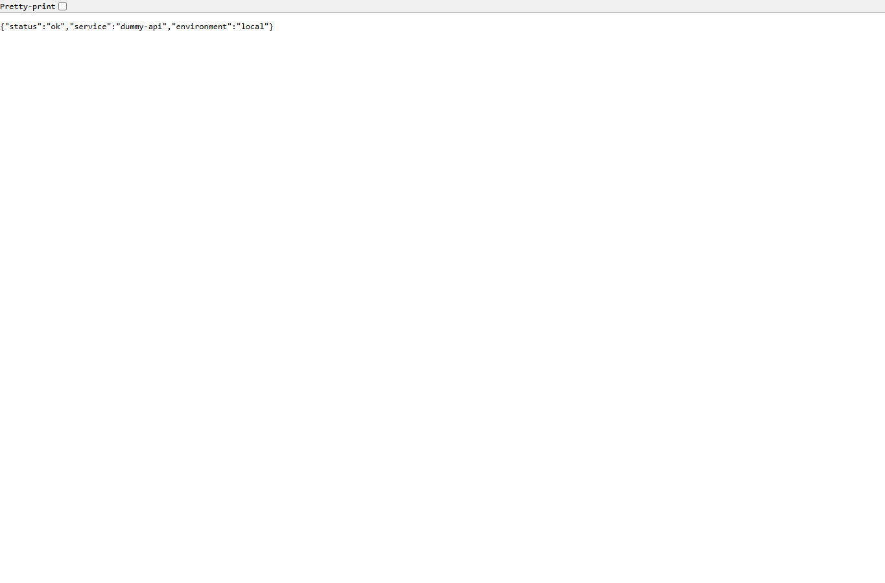
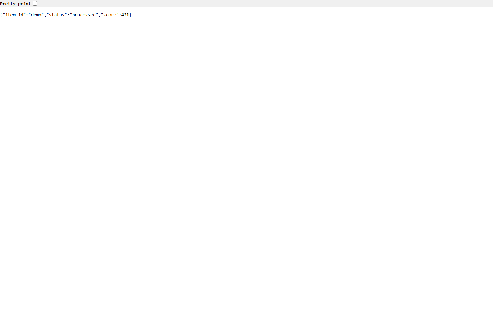

# Onboarding A Project To Ops Board

This guide is for teammates who want their project to be visible and debuggable in Ops Board.

## Why Use Ops Board

Ops Board gives us one private place to understand project health across local computers, VPSs, cloud providers, and countries.

It helps because:

- We stop guessing where a project runs.
- We can tell whether a service is alive before digging into code.
- We can debug slow APIs and failed jobs through traces and logs.
- We share the same language for service name, environment, owner, health, traces, and runtime host.
- Tailscale keeps access private without exposing dashboards to the public internet.

If your project matters enough that someone would ask "is it working?", it should probably be represented in Ops Board.

## What Onboarding Means

For v1, onboarding means:

- The project has a stable service name.
- The owner and environment are clear.
- The runtime host is documented.
- Long-running services have a health endpoint.
- Uptime Kuma can monitor that health endpoint.
- Python jobs or key functions can emit observed spans.
- SigNoz can show useful traces or logs.

## Before You Start

This guide assumes the project you are onboarding runs somewhere other than `hp-15`. For colleague projects, use this default OTLP endpoint:

```text
http://hp-15:4318
```

Use `http://localhost:4318` only for code running directly on `hp-15` itself.

Collect:

```text
service.name
service.namespace
deployment.environment
owner
runtime host
Tailscale hostname or IP
health endpoint URL
Ops Board OTLP endpoint
```

## Python Package Setup

Ops Board provides a small Python helper package. Add it to your project:

```bash
uv add "ops-board-observe @ git+https://github.com/Wenjun-Mao/ops-board.git#subdirectory=packages/ops-board-observe"
```

Then import it from your project:

```python
from ops_board_observe import bootstrap_observability, observe
```

Before calling `bootstrap_observability()`, configure the minimum service identity. For services, also set the Tailscale host and health URL that HP-15 can reach.

```dotenv
OPS_BOARD_SERVICE_NAME=my-job
OPS_BOARD_SERVICE_NAMESPACE=my-project
OPS_BOARD_ENVIRONMENT=prod
OPS_BOARD_OWNER=team-name
OPS_BOARD_RUNTIME_HOST=<runtime-host>
OPS_BOARD_OTLP_ENDPOINT=http://hp-15:4318

# Optional for services that expose health over the tailnet:
OPS_BOARD_TAILSCALE_HOST=<service-tailscale-host>
OPS_BOARD_HEALTH_URL=http://<service-tailscale-host>:<port>/health
```

## Python Script Or Scheduled Job

Use the decorator around the important unit of work:

```python
from ops_board_observe import bootstrap_observability, observe

bootstrap_observability()


@observe("my-job.run")
def run_job() -> dict[str, str]:
    return {"status": "success"}
```

Run the job, then check SigNoz for `service.name = my-job`.

## Python Web/API Service

For the API example below, use `OPS_BOARD_SERVICE_NAME=my-api` in the same minimum config block before starting the service.

Expose a health endpoint:

```python
@app.get("/health")
def health() -> dict[str, str]:
    return {"status": "ok", "service": "my-api"}
```

Wrap key handlers or functions:

```python
@observe("my-api.process-request")
def process_request(item_id: str) -> dict[str, str]:
    return {"item_id": item_id, "status": "processed"}
```

Then add the health URL to Uptime Kuma.

## Dockerized App

Pass config through environment variables:

```yaml
environment:
  OPS_BOARD_SERVICE_NAME: my-api
  OPS_BOARD_SERVICE_NAMESPACE: my-project
  OPS_BOARD_ENVIRONMENT: prod
  OPS_BOARD_OWNER: team-name
  OPS_BOARD_RUNTIME_HOST: api-host
  OPS_BOARD_TAILSCALE_HOST: api-host.tailnet-name.ts.net
  OPS_BOARD_OTLP_ENDPOINT: http://hp-15:4318
  OPS_BOARD_HEALTH_URL: http://api-host.tailnet-name.ts.net:8000/health
```

Use Docker logs plus SigNoz traces as the first debugging layer.

## Removing Ops Board Later

If the project stops reporting to Ops Board, remove the integration deliberately:

1. Remove `ops_board_observe` imports, `bootstrap_observability()`, and `@observe(...)` decorators.
2. Remove `OPS_BOARD_*` environment variables, config file entries, and Docker secrets.
3. Remove the package:

```bash
uv remove ops-board-observe
```

4. Remove or update any Uptime Kuma monitor, Homepage link, or project docs link that was added for Ops Board.
5. Run the project tests and a normal local start command.

## Remote Tailscale Machine

On the remote machine:

1. Join the same tailnet.
2. Confirm it can reach the Ops Board collector.
3. Configure `OPS_BOARD_OTLP_ENDPOINT`.
4. Run the app or job.
5. Check SigNoz from the Ops Board UI.

Health checks can point either from Uptime Kuma to the remote service's tailnet URL, or from the service host back to Ops Board if the service cannot accept inbound checks.

## First Success Test

After onboarding, prove these checks:

```text
Uptime Kuma can see the health endpoint.
SigNoz can see at least one trace from the project.
The docs say who owns the project.
The docs say where the project runs.
```

## Example Playground

Use the local playground before onboarding a real project:

```bash
docker compose -f examples/onboarding/compose.yaml up --build -d dummy-api
docker compose -f examples/onboarding/compose.yaml run --rm dummy-job
```

Then open:

```text
http://localhost:18080/health
http://localhost:18080/work/demo
```

Expected local responses:





Open SigNoz and look for:

```text
dummy-api
dummy-job
```

On a clean rebuild, SigNoz may ask you to create the first admin account before you can inspect traces. The playground still emits telemetry while you finish that setup.
